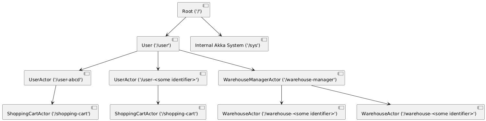

# Introduction to Akka .Net

These are my notes/knowledge while learning and working with Akka .Net since 2020. These pages are to help give a base knowledge of Akka .Net, and I try to use real-world example where I can. My goal is to make Akka .Net as accessible as possible, and when I was first learning I had trouble seeing the big picture/overview of what Akka .Net is. This page will give you a good baseline of the Akka .Net system. These are intended to be open-source notes, built with the community in mind. Feel free to make suggestions or edits, or open issues if you seek more clarification or knowledge on a specific topic. 

**Table of Contents**
- [Introduction to Akka .Net](#introduction-to-akka-net)
  - [What is Akka .Net?](#what-is-akka-net)
  - [What is an actor system](#what-is-an-actor-system)
  - [Actor Hierarchy](#actor-hierarchy)
    - [ActorSelection](#actorselection)
    - [Supervision](#supervision)
  - [Types of Actors](#types-of-actors)
    - [UntypedActor](#untypedactor)
    - [ReceiveActor](#receiveactor)
    - [Actor Lifecycle](#actor-lifecycle)
  - [Messages and Mailboxes](#messages-and-mailboxes)
    - [Ask vs Tell](#ask-vs-tell)
    - [Mailboxes](#mailboxes)
    - [Smaller is Better](#smaller-is-better)
    - [Scheduled Messages](#scheduled-messages)
  - [Finite State Machine (FSM)](#finite-state-machine-fsm)


## What is Akka .Net?

Akka .Net is a framework that can be used on top of C# and F# projects to create distributed systems that are easily scalable and resilient. There are a lot of different industries that use akka .net: finance, healthcare, gaming, gambling, stock trading, and more. Akka .Net is an actor system, which does require a learning curve to get started, but easily understood. 

Akka .Net specifically is a dotnet port of the Akka project (built in scala). Akka .Net is an open source repository and maintained by the community and Petabridge. The main documentation can be found at [https://getakka.net](https://getakka.net/index.html).


## What is an actor system

An actor is a component within the system. It can be a part that communicates with an API or a database, it can represent an object or a group of objects, really most anything. Actors communicate with each other not by method calls but by sending messages to each other. This prevents one process from hogging a thread, encapsulates an objects data to itself, and allows for actors to react to what's happening in the system. Each actor has a mailbox (queue) that it uses to receive messages. Messages are processed in the order that they are received, based on their internal akka state. An actor internal akka state (**F**inite **S**tate **M**achine) will be covered later, it's best understood after learning the basics of the actor system and messages. 

For example, you're building an online shopping cart. Here are some actors that you may have in the system:
- **User**
  - 1 actor for each user in the system
  - The actor is the source of truth for the user's data
  - **ShoppingCart**
    - A child actor of the **User**
    - The source of truth for what is in the user's current shopping cart
  - **PreviousOrder**
    - Can be N number of actor's that are a child of a user
    - Contains the different status and contents of completed orders that a user has made
- **WarehouseManager**
  - An actor that works as a saga or a process that aggregates and queries it's children for information
  - **WarehouseActor**
    - Can be N number of actor's that represent a specific warehouse at a specific location



## Actor Hierarchy 

As you can see in the example above, an actor can have children, and their children can have children. All of the actors that you'll create will be under the `/user` branch. The internal akka system creates its own actors under `/system`, and they can mostly be ignored by the implementation actors. 

### ActorSelection 

In order to send messages to different actors, you'll need to know their address within the system. There's 2 main ways to do that, pass in the IActorRef object reference to the constructor of the actor via dependency injection, or query for the IActorRef with the target actor's route. Only the actors on the `/user` branch are queryable. You can use either the relative path from the current actor, or the absolute path. When initializing the actor, a name is required, which is it's endpoint within the actor system. If the actor represents an instance of an object, then the name will need to include some unique identifier for that actor, like a primary key. 

- Customer ABCD => `/user/user-abcd`
- Warehouse EFGH => `/user/warehouse-manager/warehouse-efgh`

The ActorManager is a pattern where a type of instance actors have a parent that controls their creation, message forwarding, and supervision. When using the ActorManager, messages from other actors are sent to the manager instead of the actor itself. This means that the message will need to include a primary key or some unique identifier so the manager knows which actor to deliver the message to. The ActorManager is useful because the IActorRef of the manager can be inserted via dependency injection, and it give you a little bit more control. There are different parts of Akka .Net internals that use the ActorManager pattern. 

### Supervision

A parent actor will supervise their children. That means if/when a child actor throws an exception, the parent will be made aware of it. During initialization, the parent will set a `SupervisionStrategy` and will determine if the child actor should be resumed, restarted, stopped, or the parent can throw the same exception. The action taken can change based on the type of exception that is thrown. If it's a known/expected exception, then the child could just resume. If it's an unknown/unexpected error, then maybe restart the child because it's internal state is unstable.

If the parent throws the exception, then it'll go to the "grandparent" of the original actor, or the parent of the parent. The specific `SupervisorStrategy` that is used is important, so you'll need to determine if the default values are good enough.

## Types of Actors

There are a various different types of actors within Akka .Net. The main 2 are `UntypedActor` and `ReceiveActor`. For specific use cases, there is the `PersistentActor`, which will be covered later. Most every actor is either an `UntypedActor` or a `ReceiveActor`. Each is an abstract class that needs to be inherited/implemented, which is what makes that class an actor. The only difference between the 2 are how they handle incoming messages. They both have the same features, in fact `ReceiveActor` inherits from `UntypedActor` and `ReceiveActor` seems to be the preferred implementation.

### UntypedActor

The `UntypedActor` abstract class handles received messages by overriding the method `OnReceive`. The parameter is type `object`, so if messages are different types, you'll need to figure out what type it is before handling it.

```c#
protected override void OnReceive(object message) 
{
    switch(message.GetType())
    {
        case HelloWorld msg: // do work
            break;
        case string msg2: //do work
            break;
        default:
            log.Error($"Received unsupported message type {message.GetType()}");
    }
}
```

### ReceiveActor

The `ReceiveActor` abstract class handles typed messages better. Instead of a single `OnReceive` method, you can define what work needs to be done to a messages by calling the `Receive<T>` method with that specific type. The parameter is a predicate on how to process the message. You can only call these methods when initializing in the constructor and when changing the internal akka state via the `Becoming` method. 

```c#
public MyActor() 
{
    Receive<HelloWorld>(msg =>
    {
        // do work
    });
    ReceiveAsync<string>(async msg =>
    {
        // do asynchronous work
    });
    Receive<object>(HandleUnsupportedTypes);
}
public void HandleUnsupportedTypes(object msg)
{
    log.Error($"Received unsupported message type {message.GetType()}");
}
```

### Actor Lifecycle

## Messages and Mailboxes

Unlike an actor, there is nothing "special" that makes an object a message. A message can be anything from a string, int, double, object, etc. No inheritance is required like an actor, and there's not a limitation from what I've found. 

### Ask vs Tell

There are 2 ways that actors send messages to each other. They will either `Tell` the target actor the message, or they'll `Ask` the target actor the message. The main difference is synchronous execution vs asynchronous execution. With `Tell`, the Sender will tell the target the message and not wait for a reply. It will continue processing its next messages, fire and forget. With `Ask`, the actor pauses all work until it gets a reply, so that thread is locked until the actor gets a response. For most use cases, `Tell` will be better than `Ask`, especially if the response isn't required to process other messages. 

For example, if you're building an online shopping system and someone adds an item to their shopping cart, different actors will handle that differenty. The shopping cart will want to check with the inventory actor that we actually have the item in stock before adding it to the shopping cart

```c#
// AddToShoppingCart - check inventory
public class ShoppingCartActor : ReceiveActor
{
    private IActorRef InventoryActor
    private ShoppingCartState _state;
    public ShoppingCartActor()
    {
        ReceiveAsync<AddItem>(async msg => 
        {
            var response = await InventoryActor.Ask(new IsInStock(message.ItemId));
            //since this line is awaited, we don't want to process anything else in the shopping cart until we can verify that the item is in stock. Any new messages that are received will be added to the actor's mailbox and wait their turn to be executed.
        });

        Receive<GetState>(async msg => 
        {
            Sender.Tell(msg);
            // we don't need to wait for a response. Some other actor Told us that they needed this specific shopping cart's state and then continued processing their other message. We'll Tell them our state and let them do whatever they want with it. 
        });
    }

}
```

### Mailboxes

An actor's mailbox is just a queue that holds messages until the actor is ready to process them. They will be delivered to the actor in the order that they're received, so it's usually first in first out. If the internal actor state changes (covered later under FSM), then a message may be deemed not ready to be processed and is sent to the back of the queue.

The mailbox is maintained by the internal actor system, so we just need to worry about how the actor processes the messages. You can also override and create your own mailbox, but usually that's not necessary. That only depends if you want to process a specific received message immediately when it's received, i.e. the [UnboundPriorityMailbox](https://getakka.net/articles/actors/mailboxes.html#unboundedprioritymailbox)

### Smaller is Better


For example, if you're building a warehouse system and a new invoice came in, instead of including each product in a big list, it is a better practice to just get the primary keys and then get the data you need:

```c#
// depending on the contents of Item and the quantity in the list, this message could be quite big (50mb+)
public class PlacedOrder 
{
    public List<Item> ItemsOrdered { get; set; } 
}

// it's better to only include ids and query for whatever specific information this actor needs to process the order
public class PlacedOrder
{
    public List<string> ItemsOrdered { get; set; }
}
```

### Scheduled Messages

## Finite State Machine (FSM)

An actor can be a finite state machine which is where the actor will only handle specific message types if it's in a specific state. (I have started calling this as an actor's internal state, since the term "actor's state" can mean many different things). This useful if you have an actor that needs to process a specific workflow, but you want to queue messages to be process outside of the current state, or in the next stage. Internally, whenever the actor is ready to process the next message, it checks the message type against its internal state. If the message is not ready to be handled, then it's added to the end of the mailbox, and the next message is then attempted to be handled.

There are methods that you use to change the actor's internal state: `Become`, `BecomeStacked`, and `UnbecomeStacked`. `Become` is called with a parameter that defines the new message handlers. If `Become` is called a second time, it will then replace whatever current internal actor state is defined. If `BecomeStacked` is called second, then that set of message handlers is stacked on top of whatever the internal actor state was there before. Once `UnbecomeStacked` is called, the top `BecomeStacked` set of message handlers is removed and whatever is beneath it takes its place.

For example, you have an actor and you want to load some data from a database or an API because processing messages requires that data. You'll want to start queueing the messages that it should process once the data is loaded, but not before. 

```c#
public class CustomerActor : ReceiveActor
{
    private CustomerDetails customerDetails { get; set; }
    public CustomerActor()
    {
        ReceiveAsync<Initialize>(msg => 
        {
            // call some database or API to load CustomerDetails
            Become(ReadyToProcess);
        });
    }

    public void ReadyToProcess()
    {
        Receive<ChangeAddress>(msg => {});
        Receive<PlaceOrder>(msg => {});
    }
}
```

However, there are a few messages that are exempt from an actor's internal state. These are internal messages that the actor system uses and they will be processed no matter what, once it's their turn in the queue. The best example is `PoisonPill`. This is an internal message that is intended to kill the target actor no matter what. This is used if the actor system is shutting down, during Akka.Clustering if the actor needs to move servers, and maybe some more rare but specific scenarios. Messages are always processed in the order that they're received, but only 4 internal actor system messages (`Terminated`, `AddressTerminated`, `Kill`, `PoisonPill`, `ActorSelectionMessage`, `Identity`) disregard the actor's internal state. 99.9% of the time, it's a non-issue and doesn't warrant any concern.

